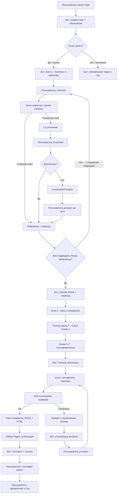
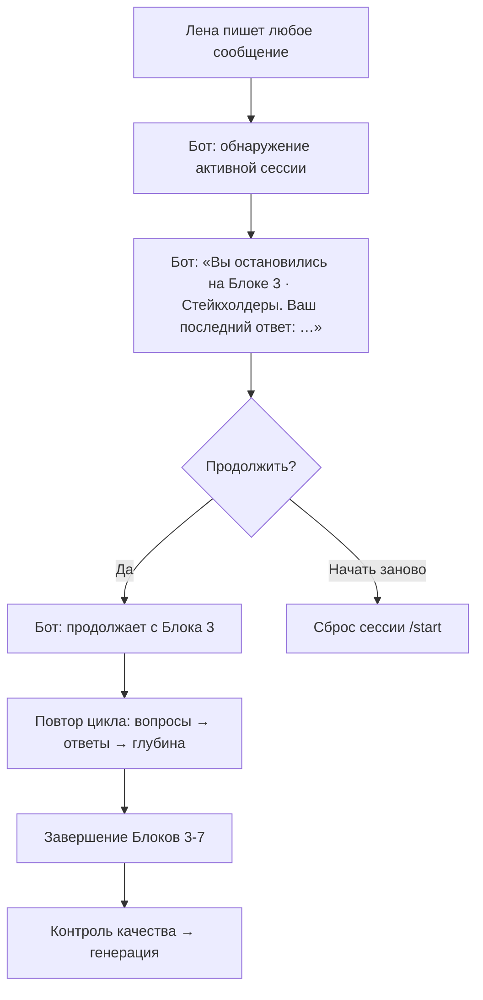
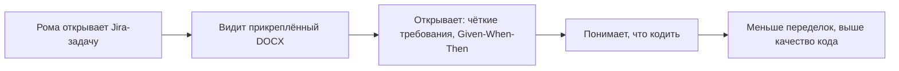

---
stepsCompleted:
  - step-01-init
  - step-02-discovery
  - step-03-core-experience
  - step-04-emotional-response
  - step-05-inspiration
  - step-06-design-system
  - step-07-defining-experience
  - step-08-visual-foundation
  - step-09-design-directions
  - step-10-user-journeys
  - step-11-component-strategy
  - step-12-ux-patterns
  - step-13-responsive-accessibility
  - step-14-complete
inputDocuments:
  - prd.md
  - architecture.md
  - prd-validation-report.md
  - product-brief-Мамкин аналитик-2026-07-08.md
  - requirements.md
workflowType: create-ux-design
projectName: Мамкин аналитик
lastStep: 14
date: 2026-07-08
author: UX Designer (BMAD Subagent)
---

# UX Design Specification — Мамкин аналитик

**Автор:** UX Designer (BMAD Subagent)
**Проект:** Мамкин аналитик — мультиагентный Telegram-бот для формирования бизнес-требований
**Дата:** 2026-07-08
**Статус:** ✅ Завершён

---

## 1. Executive Summary

### 1.1 Project Vision

«Мамкин аналитик» — мультиагентный сервис в Telegram, который помогает владельцам продуктов (Product Owners) и бизнес-аналитикам создавать бизнес-требования высокого уровня зрелости. Вместо статического шаблона или пустого документа пользователь проходит динамический диалог с четырьмя специализированными AI-агентами (опросчик, составитель, контролёр, генератор), которые совместно формируют глубокий, структурированный документ БТ.

Сервис решает проблему низкой культуры работы с бизнес-требованиями: пользователи тратят много времени, используют разные шаблоны, формулируют поверхностные требования без анализа корневых причин. Уникальность решения — в сочетании адаптивного глубинного опроса, мультиагентного контроля качества и самообучения.

### 1.2 Target Users

| Роль | Тип | Описание | UX-потребности |
|------|-----|----------|----------------|
| **Катя, Лена, Данил, Роман, Кирилл** | Primary (PO) | Владельцы продуктов, инициирующие новые инициативы | Быстро получить качественный БТ, минимум усилий, понятный процесс |
| **Бизнес-аналитики** | Primary | Профессионально занимаются БТ | Единый стандарт, глубина проработки, инструмент для работы |
| **Разработчики** | Secondary | Получатели БТ | Чёткие, конкретные требования без «воды» |
| **Руководители** | Secondary | Оценивают трудозатраты | Воспроизводимая, документированная оценка |

### 1.3 Key Design Challenges

1. **Conversational depth control:** Как сделать так, чтобы пользователь не воспринимал уточняющие вопросы как назойливость, а понимал их ценность?
2. **Zero learning curve:** Пользователь должен начать продуктивно использовать бота с первого сообщения без обучения и инструкций
3. **Emotional resilience при поверхностных ответах:** Как мотивировать пользователя углубляться, не вызывая раздражения?
4. **Long session stamina:** Опрос по 7 блокам может занимать 15-30+ минут — как удерживать внимание и мотивацию?
5. **Interruption recovery:** Пользователь может прерваться и вернуться — как обеспечить бесшовное продолжение?

### 1.4 Design Opportunities

1. **«Эффект терапевта»:** Пользователь открывает для себя глубину проблемы, о которой не подозревал → wow-эффект
2. **Геймификация глубины:** Визуальная индикация «уровня проработки» (L1→L2→L3) как прогресс-бар качества
3. **Мгновенная ценность:** Первый готовый документ → моментальное понимание ценности сервиса
4. **Самообучение как персонализация:** Каждая сессия становится точнее предыдущей → долгосрочная лояльность

---

## 2. Core User Experience

### 2.1 Defining Experience

**Основное взаимодействие:** Пользователь ведёт диалог с AI-агентом в Telegram, отвечая на серию вопросов, которые адаптируются под глубину его ответов. Агент не принимает поверхностные ответы — он вежливо, но настойчиво «копает» до корневой причины. После завершения всех 7 блоков пользователь получает готовый документ БТ.

**Core loop пользователя:**
1. Получить вопрос от бота
2. Ответить своими словами (естественным языком)
3. Получить уточняющий вопрос (если ответ поверхностный) → или подтверждение/переход к следующему разделу
4. Повторять, пока все 7 блоков не заполнены
5. Получить готовый DOCX + ссылку на веб-версию

**Что делает взаимодействие особенным:**
- Пользователь **не заполняет форму** — он **разговаривает** с экспертом
- Бот не просто записывает ответы — он **провоцирует на глубину**
- Пользователь в конце получает **больше, чем ввёл** — структурированный, отформатированный документ

### 2.2 Platform Strategy

| Аспект | Решение |
|--------|---------|
| **Основная платформа** | Telegram (мобильный + десктопный клиенты) |
| **Вторичная платформа** | Веб-версия готового документа на GitHub Pages |
| **Формат взаимодействия** | Текстовый чат (NFR15: без голосовых команд в MVP) |
| **Устройства** | Смартфоны (primary), Desktop Telegram (secondary) |
| **Офлайн** | Не требуется (всегда онлайн) |
| **Клавиатура** | Telegram Inline Keyboard для команд, текстовый ввод для ответов |

### 2.3 Effortless Interactions

| Что должно быть effortless | Как реализуется |
|---------------------------|-----------------|
| **Начало работы** | Пользователь пишет /start → бот сразу начинает опрос, без лишних меню |
| **Ответ на вопрос** | Просто пишет текст в чат — никакой разметки, форматов, шаблонов |
| **Продолжение сессии** | Возвращается в чат, пишет любое сообщение → бот продолжает с места остановки |
| **Понимание прогресса** | В каждом сообщении бота — индикатор: «Блок 2 из 7 · Раздел 2.1» |
| **Завершение** | Команда /done или кнопка «Завершить» — без многошаговых подтверждений |

### 2.4 Critical Success Moments

| Момент | Почему критичен | UX-требование |
|--------|-----------------|---------------|
| **Первое сообщение** | Определяет, останется ли пользователь | Тёплое приветствие, чёткое объяснение ценности за 3 секунды |
| **Первый L2-вопрос** | Проверка: бот реально умный или просто скрипт? | Вопрос должен быть конкретным, релевантным, показывающим понимание контекста |
| **Первый готовый документ** | Wow-момент: «Я это написал?» | Документ выглядит профессионально, структурированно, без маркеров AI-генерации |
| **Возврат после перерыва** | Доверие: «Бот помнит, где я остановился» | Точное восстановление контекста, без потери данных |
| **Контролёр вернул на доработку** | Потенциальный negative moment | Объяснение _почему_ раздел поверхностный, конкретная рекомендация |
| **Готовый документ** | Main success moment | Ссылка на DOCX + веб-версия в одном сообщении, чёткие инструкции |

### 2.5 Experience Principles

| № | Принцип | Описание |
|---|---------|----------|
| 1 | **Сначала ценность, потом процесс** | Первое сообщение объясняет, _зачем_ это нужно, а не _как_ это работает |
| 2 | **Бот ведёт, пользователь отвечает** | Минимум команд и меню — бот задаёт направление |
| 3 | **Глубина с уважением** | Уточняющие вопросы звучат как экспертный интерес, а не как допрос |
| 4 | **Прогресс виден всегда** | Пользователь никогда не теряется в том, на каком этапе и сколько осталось |
| 5 | **Zero data loss** | Любой сбой, перерыв, ошибка — без потери введённых данных |
| 6 | **Конкретность > общность** | И вопросы, и документ — без «воды», канцелярита, художественности |

---

## 3. Desired Emotional Response

### 3.1 Primary Emotional Goals

| Эмоция | Контекст | Почему важна |
|--------|----------|--------------|
| **Уверенность** | Во время опроса: пользователь чувствует, что его понимают | Без уверенности пользователь начнёт давать формальные ответы, и глубина не будет достигнута |
| **Лёгкость** | На всём протяжении: процесс не напрягает | Если опрос ощущается как работа — пользователь бросит |
| **Удивление** | При получении готового документа: «Ого, я и не думал, что так глубоко проработаю» | Ключевой wow-фактор, конвертирующий в повторное использование |
| **Доверие** | После 2-3 сессий: бот задаёт всё более точные вопросы | Самообучение должно ощущаться как персонализация |

### 3.2 Emotional Journey Mapping

```
Этап                    → Желаемая эмоция        → Риск
─────────────────────────────────────────────────────────────
Discovery (первый вход)  → Любопытство             → Скепсис («очередной бот»)
Onboarding (приветствие) → Заинтересованность      → Раздражение (длинный онбординг)
Первые вопросы (Блок 1)  → Лёгкость                → Неуверенность («а правильно ли я отвечаю?»)
L2/L3-уточнения          → Озарение («я об этом не думал») → Раздражение («достал уже копать»)
Середина опроса (Блок 3-5)→ Уверенность, поток      → Усталость («сколько ещё?»)
Финал (Блок 6-7)         → Предвкушение              → Спешка («давай быстрее»)
Готовый документ         → Удивление + гордость     → Разочарование (если документ слабый)
Повторное использование   → Узнавание, предвкушение → Повторение («всё то же самое»)
```

### 3.3 Micro-Emotions

| Микро-эмоция | Когда возникает | UX-решение |
|-------------|-----------------|------------|
| **«Меня слышат»** | Бот переформулирует ответ пользователя перед следующим вопросом | Агент-опросчик должен рефлексировать: «Я правильно понял, что…» |
| **«Я молодец»** | После глубокого ответа | Подтверждение: «Отлично, это важный аспект. Зафиксировал.» |
| **«Ну ок, уговорил»** | Когда контролёр возвращает на доработку | Контролёр объясняет _почему_ нужно уточнить, а не просто «недостаточно глубоко» |
| **«О, я уже на середине»** | Прогресс-индикатор | «Блок 3 из 7 — вы на середине!» |
| **«Вау, красиво»** | При открытии DOCX/веб-версии | Документ должен быть профессионально оформлен, с оглавлением, стилями |

### 3.4 Design Implications

| Эмоциональная цель | UX-решение |
|--------------------|------------|
| **Уверенность** | Рефлексия ответа перед следующим вопросом: «Итак, вы сказали, что… Правильно?» |
| **Лёгкость** | Короткие сообщения бота (2-3 предложения max), никаких «водяных» абзацев |
| **Удивление** | Итоговый документ содержит инсайты, которые пользователь сам не формулировал, но они логически вытекают из его ответов |
| **Доверие** | Самообучение проявляется в более точных вопросах в следующих сессиях |
| **Минимизация раздражения при L2/L3** | Уточняющий вопрос начинается с объяснения «зачем»: «Чтобы лучше понять корень проблемы, уточню…» |

### 3.5 Emotional Design Principles

1. **Принцип терапевта:** Бот не судит, не оценивает, а помогает пользователю _самому_ прийти к глубокому пониманию
2. **Принцип уважения времени:** Каждое сообщение бота добавляет ценность — если сообщение можно удалить без потери смысла, оно лишнее
3. **Принцип прогресса:** Пользователь всегда знает, где он, сколько прошёл и сколько осталось
4. **Принцип безопасности:** Любой ответ можно изменить, к любому блоку можно вернуться — нет необратимых действий

---

## 4. UX Pattern Analysis & Inspiration

### 4.1 Inspiring Products Analysis

| Продукт | UX-паттерн | Что берём для «Мамкин аналитик» |
|---------|-----------|----------------------------------|
| **ChatGPT / Claude** | Conversational AI с рефлексией | Рефлексия ответа пользователя перед следующим вопросом; естественный диалог |
| **Typeform** | One question at a time | Один вопрос за раз — не перегружать пользователя; прогресс-бар |
| **Replika / Pi (emotional AI)** | Эмпатичный тон, «как друг» | Тёплый, поддерживающий тон; использование эмодзи умеренно |
| **Notion AI** | Генерация структурированного контента из хаотичного ввода | Превращение разговорных ответов в формальный документ |
| **Telegram-боты (Grundium, @BotFather)** | Привычные паттерны: inline keyboard, /команды | Использовать стандартные Telegram-паттерны, не изобретать велосипед |
| **GitHub Copilot** | Адаптивные подсказки на основе контекста | L2/L3-вопросы должны быть контекстно-релевантными, а не шаблонными |

### 4.2 Transferable UX Patterns

**Conversational patterns:**

| Паттерн | Источник | Адаптация для проекта |
|---------|----------|----------------------|
| **One-thing-at-a-time** | Typeform | Один подраздел шаблона = один диалоговый шаг. Не показывать все 7 блоков сразу |
| **Reflective listening** | ChatGPT | «Я правильно понял, что основная проблема — это…?» — перед переходом |
| **Progressive disclosure** | Google Forms (branching) | L1→L2→L3 вопросы показываются только если нужны, не захламляют диалог |
| **Typing indicator as thinking** | Telegram API | Бот показывает «печатает…» при обработке — создаёт ощущение живого собеседника |
| **Persistent progress bar** | Typeform, Duolingo | В каждом сообщении — «Блок X из 7 · Подраздел Y» |

**Feedback patterns:**

| Паттерн | Источник | Адаптация |
|---------|----------|-----------|
| **Confirmation** | Все мессенджеры | «Принято!» после каждого ответа + краткая рефлексия |
| **Error as conversation** | ChatGPT | Ошибка не как системное сообщение, а как естественная реплика: «Давайте вернёмся к этому моменту, я не совсем понял…» |
| **Celebration micro-moment** | Duolingo | После завершения блока: краткое поздравление + что дальше |

### 4.3 Anti-Patterns to Avoid

| Анти-паттерн | Почему опасен | Альтернатива |
|-------------|---------------|--------------|
| **Длинные сообщения бота (>5 предложений)** | Пользователь не дочитает, пропустит суть вопроса | Каждое сообщение — 1 мысль, 1 вопрос |
| **Много команд в меню** | Паралич выбора | Только /start, /cancel, /help — всё остальное ведёт бот |
| **Оценка ответов («хорошо», «отлично»)** | Создаёт давление: пользователь боится ответить «неправильно» | Нейтральное «Принято. Давайте уточню…» |
| **Технический жаргон** | Пугает не-технических PO | Язык пользователя, а не разработчика |
| **Потеря контекста при возврате** | Пользователь чувствует, что его не уважают | Всегда показывать последний вопрос + ответ при возврате |
| **Принудительная линейность без возможности вернуться** | Пользователь не может исправить ошибку | /back — вернуться к предыдущему блоку |

### 4.4 Design Inspiration Strategy

| Стратегия | Что делаем |
|-----------|------------|
| **Adopt** | Conversational one-question-at-a-time (Typeform), reflective listening (ChatGPT), прогресс-бар |
| **Adapt** | Typeform-подход к Telegram: вместо веб-форм используем чат-сообщения с inline keyboard для действий |
| **Adapt** | Duolingo-прогресс: текстовый, а не визуальный — «Блок 3 из 7 — 42%» |
| **Avoid** | Всё, что требует от пользователя форматирования ответа, выбора из сложных меню, заполнения форм |

---

## 5. Design System Foundation

### 5.1 Design System Choice

**Выбор:** Кастомный «дизайн-система для Telegram-бота» (Conversation Design System)

**Обоснование:** Традиционные UI design systems (Material Design, Ant Design) не применимы для чат-бота. Единственный интерфейс — текстовые сообщения Telegram. «Дизайн-система» — это набор правил для:

- Структуры и форматирования сообщений бота
- Тональности и стиля текста
- Паттернов диалога
- Использования Telegram-фич (inline keyboard, markdown, эмодзи)
- Обработки состояний (ожидание, ошибка, возврат)

### 5.2 Message Architecture

Каждое сообщение от бота следует фиксированной структуре:

```
[Эмодзи-индикатор] [Статус/Блок]

[Основное сообщение — 1-3 предложения]

[Вопрос пользователю]

[Inline Keyboard — опционально]
```

**Пример структуры:**

```
📋 Блок 2 из 7 · Цель и измерение

Вы сказали, что хотите сократить время обработки заявок.
Давайте сформулируем это как измеримую цель.

Какой конкретный результат вы хотите получить?
Например: «снизить время обработки с 3 дней до 4 часов»

[Пропустить уточнение] [Вернуться к Блоку 1]
```

### 5.3 Message Types

| Тип сообщения | Эмодзи | Структура | Пример |
|--------------|--------|-----------|--------|
| **Opening (вопрос)** | 📋 | Приветствие + контекст + вопрос + инлайн-кнопки | «📋 Блок 1: расскажите о проблеме…» |
| **Reflection (рефлексия)** | 💡 | Переформулировка + подтверждение + следующий вопрос | «💡 Я правильно понял, что…» |
| **Deepening (L2/L3)** | 🔍 | Причина уточнения + конкретный вопрос | «🔍 Чтобы понять корень: приведите пример из последней недели» |
| **Confirmation** | ✅ | Подтверждение + что дальше | «✅ Принято! Переходим к Блоку 2.» |
| **Error recovery** | 🔄 | Извинение + восстановление | «🔄 Извините, вернёмся к предыдущему вопросу…» |
| **Progress** | 📊 | Где пользователь + сколько осталось | «📊 Прогресс: Блок 3 из 7 (42%)» |
| **Success (финал)** | 🎉 | Поздравление + ссылки на документы | «🎉 Готово! Вот ваш документ…» |
| **System message** | ⚙️ | Техническая информация | «⚙️ Ваш документ готовится… Это займёт около минуты» |

### 5.4 Tone of Voice Guidelines

| Аспект | Правило | Пример ✅ | Пример ❌ |
|--------|---------|-----------|-----------|
| **Обращение** | На «вы», но без излишней формальности | «Расскажите о вашей задаче» | «Изложите суть инициативы» |
| **Длина** | 1-3 предложения на сообщение | «Давайте уточним. Что конкретно занимает больше всего времени?» | «Уважаемый пользователь, для более детального понимания проблемной области просим вас конкретизировать…» |
| **Эмодзи** | Умеренно, 1 на сообщение, только информативные | «✅ Принято!» | «😊👍🌟 Отлично, замечательный ответ!» |
| **Уточнения** | Объяснять «зачем» перед вопросом | «Чтобы лучше понять вашу ситуацию: как давно это длится?» | «Как давно это длится?» |
| **Ошибки** | Признавать и исправлять без драмы | «Кажется, я вас не так понял. Давайте уточним…» | «Извините, произошла ошибка в обработке запроса» |
| **Подтверждение** | Нейтральное, без оценки | «Принято. Перехожу к следующему разделу.» | «Отличный ответ! Вы молодец!» |

### 5.5 Custom Components (Conversational)

**Component: Progress Badge**
- Формат: `📋 Блок X из 7 · Подраздел Y`
- Расположение: первая строка каждого сообщения бота
- Цель: пользователь всегда знает своё местоположение

**Component: Reflection Block**
- Формат: `💡 Вы сказали: «[цитата]». Я правильно понял?`
- Когда: после каждого развёрнутого ответа, перед следующим вопросом
- Цель: подтверждение понимания + возможность исправить

**Component: Deepening Ladder**
- Уровни: L1 (открытый вопрос) → L2 (уточняющий) → L3 (корневой)
- Отображение: только активный уровень, без показа всей лестницы
- Переход: только когда контролёр фиксирует недостаточную глубину

**Component: Session Recovery**
- Формат: `🔄 Вы остановились на [Блок X, Подраздел Y]. Ваш последний ответ: «[цитата]». Продолжим?`
- Когда: пользователь возвращается после паузы > 30 минут
- Цель: бесшовное продолжение без потери контекста

---

## 6. Core Experience Mechanics

### 6.1 Defining Experience

**Формулировка:** «Пользователь ведёт диалог с AI-экспертом, который помогает сформулировать глубокие бизнес-требования через серию адаптивных вопросов, и получает готовый профессиональный документ.»

**Core action:** Ответить на вопрос → получить следующий, более глубокий или перейти дальше.

**Mental model:** «Я разговариваю с опытным бизнес-аналитиком, который задаёт правильные вопросы, чтобы я сам сформулировал то, что нужно.»

### 6.2 User Mental Model

| Аспект | Текущее поведение пользователя | Ожидаемое поведение |
|--------|-------------------------------|---------------------|
| **Подготовка БТ** | Открывает Confluence/Word, пишет «от балды» | Открывает Telegram, отвечает на вопросы бота |
| **Глубина** | 1-2 предложения на раздел | Развёрнутые ответы с примерами, цифрами, контекстом |
| **Структура** | Каждый раз разная | Единый шаблон (7 блоков) |
| **Качество** | Поверхностное, без анализа корней | Глубокое, с анализом причин, рисков, стейкхолдеров |
| **Время** | 2-4 часа на «отписку» | 20-30 минут на качественный документ |

### 6.3 Success Criteria for Core Experience

| Критерий | Измерение |
|----------|-----------|
| Пользователь отвечает на L2/L3-вопросы без раздражения | Анализ тональности ответов + частота команд /cancel или /help |
| Пользователь доходит до конца опроса (7 блоков) | % завершённых сессий от начатых |
| Пользователь получает документ и может его сразу использовать | Доля сессий, после которых DOCX прикреплён в Jira |
| Пользователь возвращается для новой сессии | Repeat usage rate |
| Среднее время сессии | ≤ 30 минут для первого использования |

### 6.4 Novel vs Established Patterns

| Аспект | Оценка | Решение |
|--------|--------|---------|
| **Бот проводит опрос** | Established | Привычный паттерн (многие боты так делают) |
| **Адаптивная глубина (L1→L2→L3)** | Novel | Пользователь не знаком с этим — требуется объяснение в начале |
| **Мультиагентное качество** | Invisible | Пользователь не знает про контролёра — это внутренняя фича |
| **Самообучение** | Invisible | Проявляется только в следующих сессиях |
| **Контроль качества с возвратом** | Novel | Пользователь может удивиться, что его ответ «забраковали» — требуется деликатная формулировка |

### 6.5 Experience Mechanics Detail

**Step 1 — Initiation:**
- Команда `/start` → бот приветствует
- Первое сообщение: «Привет! Я помогу составить бизнес-требования. Это займёт 15-30 минут. Я задам вопросы по 7 разделам — отвечайте своими словами. Если нужно будет уточнить, я спрошу. Готовы?»
- Кнопка: «✅ Начнём»

**Step 2 — Interaction (core loop):**
- Бот: вопрос по текущему подразделу (L1)
- Пользователь: текстовый ответ
- Система: агент-опросчик оценивает глубину ответа
  - Если глубокая → рефлексия + переход к следующему подразделу
  - Если поверхностная → L2-вопрос
  - Если L2 тоже поверхностный → L3-вопрос
- После каждого ответа: автосохранение черновика
- После завершения блока: краткое резюме + переход

**Step 3 — Quality gate (invisible to user):**
- После заполнения всех 7 блоков:
  1. Агент-составитель формирует черновик
  2. Агент-контролёр проверяет
  3. Если всё ОК → генерация
  4. Если проблемы → возврат к конкретным блокам с объяснением

**Step 4 — Completion:**
- Бот: «Готово! Проверьте документ: [ссылка DOCX] [ссылка веб-версия]»
- Дополнительно: краткая статистика (сколько блоков, уровень глубины)

---

## 7. Visual Design Foundation

### 7.1 Color System

Поскольку интерфейс — Telegram-чат, визуальный дизайн минимален. Цвета используются в:

- **Telegram markdown-форматировании текста**
- **Эмодзи** (единственные визуальные элементы)
- **Фоне DOCX и веб-версии** документа

**Telegram-бот (текстовый):**
- Основной текст: стандартный чёрный (Telegram default)
- Выделение: **жирный** (для ключевых слов), *курсив* (для цитат)
- Код: `моноширинный` (для названий команд)
- Эмодзи-индикаторы: как указано в Message Types (📋 💡 🔍 ✅ 🔄 🎉)

**DOCX/веб-версия документа БТ:**
- Заголовки: тёмно-синий (#1A365D)
- Основной текст: тёмно-серый (#2D3748)
- Акценты: синий (#3182CE)
- Таблицы: светло-серый фон заголовков (#EDF2F7)
- Успех/Подтверждение: зелёный (#38A169)

### 7.2 Typography System

**Telegram:**
- Используется системный шрифт Telegram (SF Pro на iOS, Roboto на Android)
- Размер контролируется клиентом Telegram, не нами
- Форматирование: только markdown (bold, italic, code, link)

**DOCX/веб-версия:**
- Заголовки H1: 18pt, Bold
- Заголовки H2: 14pt, Bold
- Заголовки H3: 12pt, Bold
- Основной текст: 11pt, Regular
- Таблицы: 10pt
- Межстрочный интервал: 1.15

### 7.3 Spacing & Layout Foundation

**Telegram-сообщения:**
- Каждое сообщение бота — отдельный bubble в чате
- Между сообщениями — стандартный отступ Telegram
- Inline keyboard — сразу под сообщением

**Структура сообщения (внутренняя):**
```
[пустая строка]
[Прогресс-бадж] 📋 Блок X из 7
[пустая строка]
[Основной текст] 1-3 предложения
[пустая строка]
[Вопрос] 
[пустая строка]
[Inline Keyboard — опционально]
```

### 7.4 Accessibility Considerations

| Аспект | Требование |
|--------|------------|
| **Контраст текста** | Telegram обеспечивает стандартный контраст |
| **Размер touch-targets** | Inline Keyboard кнопки Telegram ≥ стандартного 44px |
| **Screen reader** | Текстовые сообщения читаются VoiceOver/TalkBack без проблем |
| **Эмодзи** | Использовать только стандартные эмодзи с текстовыми описаниями в контексте |
| **Цветовая слепота** | Не полагаться только на цвет — все состояния имеют текстовые индикаторы |
| **Фокус** | Telegram обеспечивает стандартный фокус клавиатуры |

---

## 8. Design Direction Decision

### 8.1 Design Directions Explored

| Направление | Характер | Применимость |
|-------------|----------|--------------|
| **A — «Экспертный аналитик»** | Формальный, профессиональный тон, минимум эмоций | Не подходит — слишком сухо для диалога |
| **B — «Дружелюбный помогатор»** | Тёплый, неформальный, много эмодзи | Частично — хорошо для онбординга, плохо для серьёзных блоков |
| **C — «Коуч / фасилитатор»** | Вопросы-провокации, рефлексия, сторителлинг | 🏆 **Выбрано** — лучший баланс глубины и дружелюбия |

### 8.2 Chosen Direction: «Коуч / фасилитатор» (C)

**Характер:** Бот ведёт себя как опытный бизнес-аналист или коуч — задаёт правильные вопросы, рефлексирует ответы, помогает пользователю самому прийти к глубокому пониманию, но делает это в тёплой, человеческой манере.

**Тональность:**
- Уважительная, но не формальная
- Поддерживающая, но не сюсюкающая
- Глубокая, но не заумная

**Ключевые элементы:**
- Рефлексия ответов перед следующим вопросом
- Объяснение «зачем» перед уточнениями
- Краткие подтверждения без оценок
- Прогресс-бадж в каждом сообщении

### 8.3 Design Rationale

| Фактор | Почему «Коуч» |
|--------|---------------|
| **Проблема пользователя** | Пользователи не понимают ценность глубины — коуч-подход помогает её осознать |
| **Длительность опроса** | 15-30 минут — нужен человеческий тон, а не сухая анкета |
| **L2/L3-вопросы** | Коуч-подход объясняет «зачем копать», снижая раздражение |
| **Контроль качества** | Возврат на доработку формулируется как «давайте уточним» вместо «вы ответили поверхностно» |
| **Самообучение** | Персонализация следующих сессий ощущается как «меня запомнили», а не «алгоритм сработал» |

---

## 9. User Journey Flows

### 9.1 Journey 1: Первая сессия — Полный цикл

**User:** Катя, PO, первый раз использует бота



### 9.2 Journey 2: Прерванная сессия — Возврат

**User:** Лена, PO, прервалась на Блоке 3, возвращается через 2 часа



### 9.3 Journey 3: Повторное использование

**User:** Катя, вторая сессия через неделю

```mermaid
flowchart TD
    A[Катя: /start] --> B[Бот: приветствие с учётом истории]
    B --> C[Бот: «С возвращением! В прошлый раз вы работали над [проект X]»]
    C --> D[Бот: вопросы с учётом прошлых паттернов]
    D --> E[Катя отвечает — вопросы точнее, чем в первый раз]
    E --> F[Завершение → документ]
    F --> G[Самообучение: history.json обновлён]
```

### 9.4 Journey 4: Разработчик получает БТ

**User:** Рома, разработчик



### 9.5 Journey Patterns

| Паттерн | Описание | Используется в |
|---------|----------|----------------|
| **Conversational loop** | Вопрос → ответ → оценка → следующий вопрос | Все journeys |
| **Depth escalation** | L1 → L2 → L3 при поверхностных ответах | Journey 1 |
| **Session recovery** | Обнаружение паузы → восстановление контекста | Journey 2 |
| **Self-learning adaptation** | Учёт истории для персонализации | Journey 3 |
| **Disconnected consumption** | Пользователь не взаимодействует с ботом, а потребляет результат | Journey 4 |

### 9.6 Flow Optimization Principles

1. **Минимизация шагов до ценности:** Первый документ — максимально быстро (даже если черновик)
2. **Каждый шаг — прогресс:** Нет «пустых» сообщений, каждое продвигает к цели
3. **Zero dead ends:** Любой путь ведёт к завершению (даже /cancel сохраняет черновик)
4. **Graceful degradation:** При сбое DeepSeek — извиниться и предложить повторить, без потери данных
5. **Error recovery first:** Если пользователь ответил не туда — /back или кнопка «Вернуться» в каждом сообщении

---

## 10. Component Strategy

### 10.1 Telegram-Native Components

| Компонент | Использование | Источник |
|-----------|---------------|----------|
| **Текстовое сообщение** | Все вопросы и ответы бота | Telegram Native |
| **Inline Keyboard** | Кнопки подтверждения, навигации (Далее, Назад, Завершить) | Telegram Native |
| **Markdown formatting** | Выделение ключевых слов, цитат, команд | Telegram Native |
| **Typing indicator** | Имитация «думания» агента | Telegram Native |
| **/commands** | /start, /cancel, /help, /back | Telegram Native |
| **Reply-to** | Ссылка на предыдущее сообщение при уточнении | Telegram Native |

### 10.2 Custom Conversational Components

**Component 1: Progress Tracker**
- **Назначение:** Показывать пользователю текущую позицию в процессе
- **Формат:** `📋 Блок X из 7 · Подраздел Y` в первой строке сообщения
- **Состояния:**
  - Normal: показывает текущий блок/подраздел
  - Block complete: `✅ Блок X завершён — переходим к Блоку X+1`
  - Session resume: `🔄 Блок X из 7 — продолжаем с Подраздела Y`
- **Варианты:** Нет вариантов — единый формат для всех сообщений

**Component 2: Depth Indicator**
- **Назначение:** Показывать, что бот перешёл на более глубокий уровень опроса
- **Формат:** `🔍 Давайте копнём глубже: [вопрос L2/L3]`
- **Состояния:**
  - L1 (default): без индикатора — обычный вопрос
  - L2: `🔍` эмодзи + «Давайте уточним:» перед вопросом
  - L3: `🔍` эмодзи + «Попробуем добраться до сути:» перед вопросом
  - Max depth reached: `📌 Зафиксировал. Переходим дальше.` (если даже после L3 недостаточно)

**Component 3: Reflection Message**
- **Назначение:** Подтверждение понимания ответа пользователя
- **Формат:** `💡 Вы сказали: «[краткая цитата]». Я правильно понял?`
- **Состояния:**
  - Confirmation needed: вопрос на подтверждение
  - Confirmed: `✅ Всё верно. Продолжим.`
  - Correction: `🔄 Поправьте меня: [переформулировка]`
- **Triggers:** После каждого развёрнутого ответа (2+ предложения)

**Component 4: Quality Feedback**
- **Назначение:** Объяснить возврат на доработку без негатива
- **Формат:** `💡 Я заметил, что этот раздел можно проработать глубже. Конкретно: [причина]. Давайте уточним: [вопрос]`
- **Состояния:**
  - First pass: мягкое предложение уточнить
  - Second pass: более конкретный запрос
  - Force complete: `ОК, зафиксируем как есть, но рекомендую вернуться позже`
- **Triggers:** Контролёр обнаружил поверхностный раздел

**Component 5: Session Resume Card**
- **Назначение:** Бесшовное продолжение после перерыва
- **Формат:** `🔄 С возвращением! Ваша сессия сохранена.`
  `📋 Блок X из 7 · Подраздел Y`
  `Ваш последний ответ: «[цитата]»`
  `Продолжим с этого места?`
- **Кнопки:** ✅ Продолжить | 🔄 Начать заново
- **Triggers:** Пользователь пишет что-то после паузы > 30 мин

### 10.3 Component Implementation Strategy

| Component | Приоритет | Зависимости | Сложность |
|-----------|-----------|-------------|-----------|
| Progress Tracker | P0 (core) | Session Manager, Template Engine | Low |
| Depth Indicator | P0 (core) | Agent-Questioner, depth-config.json | Medium |
| Reflection Message | P0 (core) | Agent-Questioner, DeepSeek API | Medium |
| Quality Feedback | P1 (important) | Agent-Controller, quality-rules.md | High |
| Session Resume Card | P1 (important) | Session Manager | Low |

### 10.4 Implementation Roadmap

| Фаза | Компоненты | Когда |
|------|------------|-------|
| **Phase 1 — Core Loop** | Progress Tracker, Depth Indicator (L1/L2) | MVP must-have |
| **Phase 2 — Quality & Reflection** | Reflection Message, Quality Feedback, Depth Indicator (L3) | MVP must-have |
| **Phase 3 — Resilience** | Session Resume Card, Error Recovery patterns | MVP should-have |
| **Phase 4 — Polish** | Self-learning personalisation, Repeat session recognition | Post-MVP |

---

## 11. UX Consistency Patterns

### 11.1 Message Hierarchy

| Уровень | Формат | Пример |
|---------|--------|--------|
| **Progress** | `📋 [статус]` — всегда первая строка | `📋 Блок 3 из 7 · Стейкхолдеры` |
| **Reflection** | `💡 [цитата]` — после ответа пользователя | `💡 Вы упомянули проблемы с интеграцией…` |
| **Question** | `[текст] [вопрос]` — без особого форматирования | `Кто основные пользователи этой системы?` |
| **Deepening** | `🔍 [причина] [L2/L3 вопрос]` | `🔍 Чтобы понять корень: приведите пример…` |
| **Confirmation** | `✅ [статус]` — краткое подтверждение | `✅ Принято! Переходим к следующему.` |
| **Action** | `[inline keyboard]` — кнопки под сообщением | `[Продолжить] [Вернуться]` |

### 11.2 Button Hierarchy

| Тип кнопки | Цвет (Telegram default) | Функция | Расположение |
|------------|------------------------|---------|--------------|
| **Primary action** | Синий | Продолжить, Начать, Да | Первая кнопка |
| **Secondary action** | Серый | Вернуться, Пропустить, Отмена | Вторая кнопка |
| **Destructive action** | Красный | Завершить сессию | Третья кнопка (если нужно) |
| **Helper** | Серый | /help, /start | Только по командам |

### 11.3 Feedback Patterns

| Ситуация | Паттерн | Сообщение |
|----------|---------|-----------|
| **Успешный ответ** | ✅ Confirmation | `✅ Принято. Зафиксировал.` + рефлексия |
| **Поверхностный ответ** | 🔍 Deepening + explanation | `🔍 Я чувствую, тут есть глубина. Давайте уточним: [вопрос]` |
| **Ошибка DeepSeek** | ⚙️ Transparent retry | `⚙️ Техническая пауза… Ещё секунду.` (авто-retry) |
| **Ошибка сохранения** | ⚙️ Recovery | `💾 Черновик сохранён. Можете продолжать.` |
| **Долгая генерация >5s** | ⏳ Async notification | `⏳ Ваш документ готовится. Это займёт около минуты. Я пришлю ссылку, когда будет готово.` |
| **GitHub Pages failure** | ⚙️ Partial success | `✅ DOCX готов. Ссылка: [файл]. Веб-версия временно недоступна — попробуйте позже.` |

### 11.4 Form Patterns (Conversational)

| Паттерн | Реализация |
|---------|-----------|
| **Single question at a time** | Бот задаёт один вопрос → ждёт ответ → следующий вопрос |
| **Free text input** | Пользователь отвечает естественным языком, без форм |
| **Optional confirmation** | После ответа: рефлексия + «Всё верно?» (кнопка Подтвердить/Изменить) |
| **Back navigation** | Кнопка «Назад» в каждом сообщении → возврат к предыдущему подразделу |
| **Skip** | Кнопка «Пропустить» → подраздел отмечается как «не применимо» |

### 11.5 Additional Patterns

**Conversational Recovery Pattern:**
```
Пользователь: [пишет что-то не по теме]
Бот: «Я не совсем понял ответ на предыдущий вопрос. Давайте вернёмся:
[повтор вопроса]
Можете ответить кратко, если сложно сформулировать сразу.»
```

**Block Transition Pattern:**
```
✅ Блок 3 завершён!
📊 Прогресс: 3 из 7 (43%)

Давайте перейдём к Блоку 4 — описание решения.
Какие ключевые функции должно иметь решение?
```

**Session Completion Pattern:**
```
🎉 Все 7 блоков заполнены!
📊 Средняя глубина проработки: L2.2

⏳ Собираю документ… Это займёт около минуты.

[через минуту]
🎉 Готово!
📄 DOCX: [ссылка]
🌐 Веб-версия: [ссылка]

💡 Совет: прикрепите DOCX к задаче в Jira для команды разработки.
```

---

## 12. Responsive Design & Accessibility

### 12.1 Responsive Strategy

Поскольку Telegram-бот — единственный интерфейс, «отзывчивость» обеспечивается Telegram-клиентом:

| Платформа | Особенности | UX-адаптация |
|-----------|-------------|--------------|
| **Telegram Mobile (iOS/Android)** | Вертикальный экран, одна рука | Сообщения короткие, кнопки крупные, минимум скролла |
| **Telegram Desktop** | Большой экран, клавиатура | Те же сообщения — Telegram растягивает/сжимает автоматически |
| **Telegram Web** | Браузер, переменный размер | Аналогично Desktop |

**Наша ответственность:**
- Сообщения не шире 40-50 символов в ширину (читаемость на мобильных)
- Inline keyboard — не более 2-3 кнопок в ряд (помещаются на мобильных)
- Длинные сообщения (если нужно) — разбивать на несколько

### 12.2 Breakpoint Considerations

| Breakpoint | Telegram | Особенности UX |
|------------|----------|----------------|
| < 360px | Малый экран | Максимум 2 inline кнопки в ряд |
| 360-768px | Стандартный мобильный | Оптимально для чтения |
| > 768px | Desktop/Tablet | Комфортно, лишнее пространство |

**Наши сообщения не меняют вёрстку — Telegram делает это за нас.**

### 12.3 Accessibility Strategy

**Цель: WCAG 2.1 Level AA** (базовый стандарт для корпоративных инструментов)

| Требование | Реализация |
|------------|------------|
| **Perceivable** | Вся информация в текстовом виде; эмодзи не несут критической информации |
| **Operable** | Все действия доступны через текстовые команды и inline keyboard |
| **Understandable** | Ясный, предсказуемый язык; отсутствие жаргона |
| **Robust** | Совместимость со screen readers (VoiceOver, TalkBack) |

**Специфические меры:**
- Текстовые альтернативы эмодзи: каждое сообщение читаемо без эмодзи
- Крупные touch-targets: Telegram inline keyboard ≥ стандарт
- Контраст: Telegram default обеспечивает 4.5:1+
- Нет мигающих/движущихся элементов
- Все состояния имеют текстовое описание (не только цвет/иконка)

### 12.4 Testing Strategy

| Тип тестирования | Что проверяем | Инструменты |
|-----------------|---------------|-------------|
| **Responsive** | Отображение на мобильных/Desktop Telegram | Реальные устройства: iPhone, Android, Desktop |
| **Screen reader** | VoiceOver/TalkBack читаемость | Встроенные screen reader'ы |
| **Keyboard only** | Навигация по inline keyboard | Tab/Enter на Desktop Telegram |
| **Error recovery** | Поведение при сбоях DeepSeek | Mock-сценарии |
| **Long session** | Stamina через 30+ минут диалога | Реальные сессии с PO |
| **Interruption** | Восстановление после перерыва | Прерывание на разных блоках |

### 12.5 Implementation Guidelines

| Аспект | Guideline |
|--------|-----------|
| **Длина сообщения** | ≤ 3 предложений, ≤ 400 символов |
| **Inline keyboard** | ≤ 3 кнопок в ряд, ≤ 2 рядов |
| **Эмодзи** | 1 на сообщение, не ключевой для смысла |
| **Рефлексия** | Не более 1 предложения цитаты |
| **Автосохранение** | После каждого ответа (макс. 2s) |
| **Генерация DOCX** | Асинхронно: «готовится…» → уведомление |
| **Timeout** | 5s на ответ агента → fallback-сообщение |

---

## 13. Conversation Script Examples

### 13.1 Блок 1 — Контекст и проблема (L1→L2)

```
Бот:        📋 Блок 1 из 7 · Контекст и проблема

            Расскажите в двух словах: над чем работаете?
            Что за проект или инициативу мы обсуждаем?

Пользователь: Работаем над новым мобильным приложением для заказа 
             кофе в офис. Сейчас процесс отнимает много времени.

Бот:        💡 Вы сказали: «процесс отнимает много времени».
            Я правильно понял основную проблему?

            Давайте уточню: что конкретно занимает больше всего времени?
            Поиск кофе? Оформление заказа? Оплата?

            [Пропустить уточнение] Продолжить
```

### 13.2 Успешный ответ (L1 достаточно)

```
Бот:        📋 Блок 1 из 7 · Последствия бездействия

            Что будет, если ничего не менять?
            Какие последствия для бизнеса и команды?

Пользователь: Если ничего не менять, люди продолжат тратить 
             по 15 минут на заказ кофе, что при 50 сотрудниках 
             даёт 12.5 часов потерь в день. Кроме того, падает 
             удовлетворённость, когда кофе не привозят вовремя.

Бот:        ✅ Принято. Отличный анализ последствий!
            
            📋 Блок 1 завершён ✅

            📊 Прогресс: 1 из 7 (14%)

            Переходим к Блоку 2 — Цель и измерение.
            Какую бизнес-цель вы преследуете?

            [Продолжить]
```

### 13.3 Глубинный опрос (L1 → L2 → L3)

```
Бот:        📋 Блок 1 из 7 · Проблемная область
            
            Что сейчас не так? Какая ситуация заставляет вас 
            этим заниматься?

Пользователь: Всё плохо, процессы не настроены.

Бот:        🔍 Конкретизируем: приведите пример из последней 
            недели. Что произошло? Кто и как пострадал?

Пользователь: Ну, в понедельник设计师 не мог начать работу, 
             потому что не было доступа к макетам.

Бот:        🔍 А почему эта ситуация сложилась? Какая 
            коренная причина? Как давно это длится?

Пользователь: Потому что нет единого хранилища файлов 
             и процесса онбординга новых сотрудников. 
             Это длится уже полгода, с тех пор как 
             команда выросла с 5 до 15 человек.

Бот:        📌 Зафиксировал. Коренная причина — отсутствие 
            единого хранилища и онбординга при масштабировании 
            команды с 5 до 15 человек.

            ✅ Переходим к последствиям бездействия.
```

### 13.4 Возврат контролёра

```
Бот:        💡 Я проверил раздел «Качественные характеристики».
            Он заполнен, но можно проработать глубже.
            
            Вы указали, что нужна «высокая производительность».
            Давайте уточним цифры:
            
            — Сколько пользователей одновременно?
            — Какое время отклика считается приемлемым?
            — Есть ли требования по uptime?

Пользователь: До 100 одновременных пользователей, 
             отклик до 2 секунд, 99% uptime.

Бот:        ✅ Спасибо, теперь гораздо конкретнее! 
            Зафиксировал.
```

### 13.5 Прерывание и возврат

```
Пользователь: [пишет через 3 часа]
              Привет, я вернулась!

Бот:        🔄 С возвращением! 
            
            📋 Блок 3 из 7 · Стейкхолдеры
            Ваш последний ответ: «основные пользователи — 
            сотрудники офиса и бариста»
            
            Продолжим с этого места?

            [✅ Продолжить] [🔄 Начать заново]
```

---

## 14. Workflow Completion

**Статус:** ✅ Завершён

### 14.1 Что сделано

| Шаг | Раздел | Статус |
|-----|--------|--------|
| 1 | Инициализация документа | ✅ |
| 2 | Executive Summary (анализ проекта) | ✅ |
| 3 | Core User Experience | ✅ |
| 4 | Desired Emotional Response | ✅ |
| 5 | UX Pattern Analysis & Inspiration | ✅ |
| 6 | Design System Foundation | ✅ |
| 7 | Core Experience Mechanics | ✅ |
| 8 | Visual Design Foundation | ✅ |
| 9 | Design Direction Decision | ✅ |
| 10 | User Journey Flows | ✅ |
| 11 | Component Strategy | ✅ |
| 12 | UX Consistency Patterns | ✅ |
| 13 | Responsive Design & Accessibility | ✅ |
| 14 | Completion | ✅ |

### 14.2 Ключевые UX-решения

1. **Выбранная тональность:** «Коуч / фасилитатор» — тёплый, но профессиональный тон с рефлексией ответов и объяснением «зачем» перед уточнениями
2. **Message Architecture:** Фиксированная структура каждого сообщения бота (Progress → Reflection → Question → Action)
3. **Depth Control UX:** L1→L2→L3 с визуальными индикаторами (🔍) и объяснением причины уточнения
4. **Emotional Design:** Принцип «терапевта» — без оценок ответов, с нейтральными подтверждениями
5. **Anti-patterns:** Запрет на длинные сообщения, оценочные суждения, технический жаргон
6. **Session Recovery:** Бесшовное восстановление с показом последнего ответа
7. **Quality Feedback:** Возврат на доработку формулируется как «можно проработать глубже» вместо «вы ответили поверхностно»

### 14.3 Рекомендуемые следующие шаги

1. **Разработка промптов агентов** — на основе Conversation Scripts из раздела 13
2. **Реализация Session Manager** — с поддержкой автосохранения и восстановления
3. **Реализация Depth Control** — L1/L2/L3 логика в агенте-опросчике
4. **Тестирование на реальных PO** — валидация тональности и паттернов
5. **Опрос удовлетворённости** — после первых 5 сессий для калибровки UX

---

*UX Design Specification создан по методологии BMAD (create-ux-design workflow).*
*Дата: 2026-07-08*
